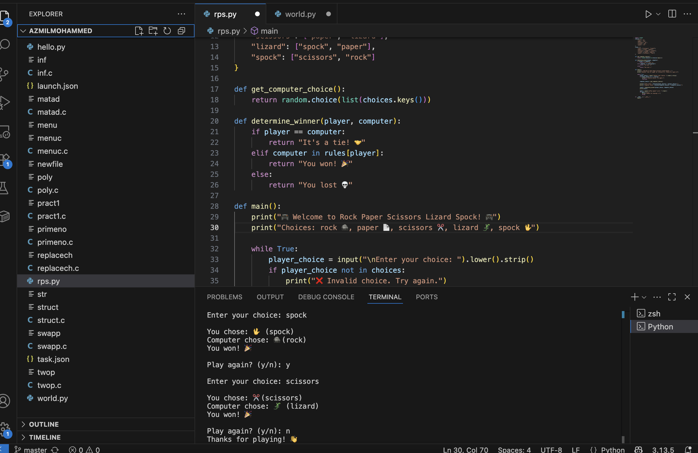

# 🪨📄✂️ Rock Paper Scissors — Python Mini Game

A simple and fun **Rock-Paper-Scissors** game built using **Python**.  
This project was made as part of a small coding challenge and runs in the terminal (VS Code or any Python environment).

---

## 🎮 How to Play

1. Run the script  
2. Enter your choice:  
   - `rock`
   - `paper`
   - `scissors`
3. The computer randomly picks one
4. Results are displayed instantly!

---

## 🛠️ Tech Stack

- **Language:** Python 🐍
- **Platform:** VS Code Terminal
- **Input/Output:** CLI (Command Line Interface)
- **Randomization:** Python `random` module

---

## 📸 Screenshot

Here’s how the game looks when played:



---

## 🚀 Features

- Lightweight and beginner-friendly
- Random computer moves
- Interactive user input
- Instant win/lose/draw results

---

## ▶️ Run the Game

```bash
python3 rock_paper_scissors.py
